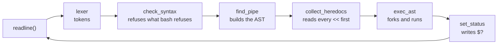
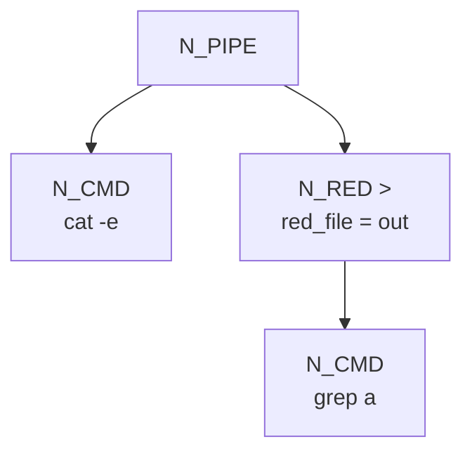
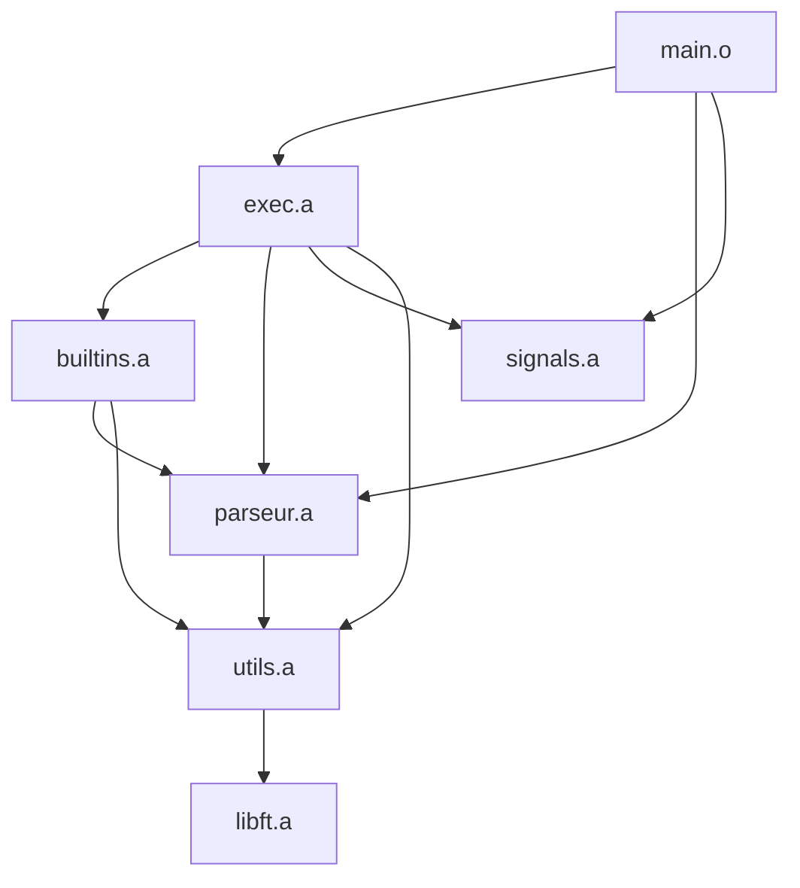
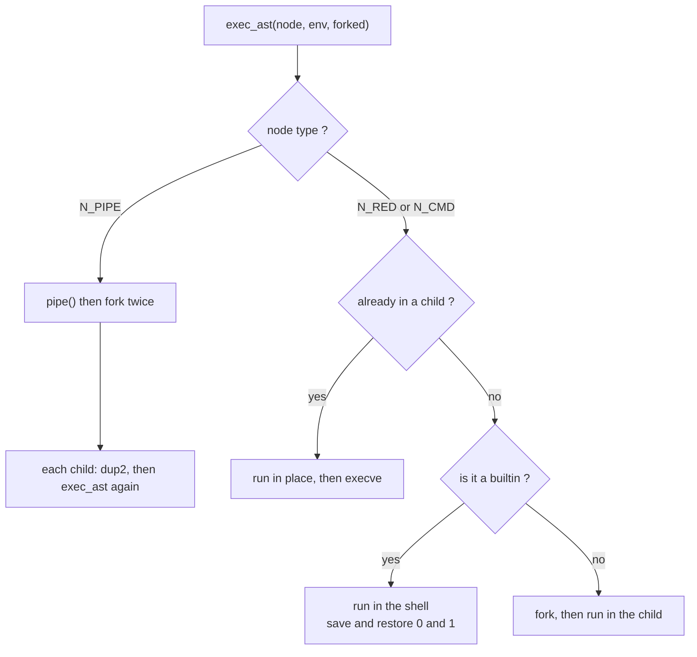

_This project has been created as part of the 42 curriculum by lheteau, anmoussa._  
_We are the 22 June 2026._

# Minishell
https://github.com/user-attachments/assets/02034ee5-d03d-45c9-90ff-2e19ad5ed273


### Table of contents
***
1. _Description_
2. _Architecture_
3. _Project structure_
4. _Instructions_
5. _Resources_
6. _New notions_

***
## **Description**
***
• Minishell is a project designed to introduce **processes** and **file descriptors**. It is a small reimplementation of bash: a prompt waits for a line, the line is cut into tokens, the tokens are assembled into a tree, and the tree is walked to actually run the commands. It handles quotes, environment variables, the four redirections, pipes, signals and seven built-in commands.

• The program is organised in **four stages**, and a line goes through all of them before anything is executed. The **lexer** walks the raw string character by character and produces a linked list of tokens, expanding `$VAR` and `$?` on the way. A **syntax pass** then reads that list once and refuses what bash refuses, with the same messages and the same exit code 2. The **parser** turns the list into an **AST** by recursive descent. Finally the **executor** walks the tree and forks.

• **The tree is the heart of the project.** Three functions call each other from the weakest priority to the strongest — `find_pipe` calls `find_red` which calls `find_cmd` — and that order is exactly what places the pipes at the top of the tree and the commands at the leaves. The executor then walks the same tree back down, which makes the whole execution a single recursive function.

• **Running a pipeline.** At a pipe node the shell creates one pipe and forks **twice**, once per branch. Each child plugs itself on the pipe with `dup2`, then calls the executor again on its own branch and `exit`s with the result. Because the tree leans to the right, the right child replays the entire rest of the pipeline — so the exit status of `a | b | c` is the status of `c` without a single extra line of code.

• **Who forks, and when.** `execve` *replaces* the running process, so the shell must always fork before running an external command. A built-in is different: `cd` or `export` must change the shell itself, so they run **in place**, with standard input and output saved and restored around them. Inside a pipe, however, a built-in runs in the child — exactly like bash.

• **Redirections are applied bottom-up.** In the tree, the *last* redirection written by the user ends up at the *top* of the chain. Applying them from top to bottom would send the output to the wrong file, so `apply_reds` recurses down to the deepest node first and opens the files on the way back up.

• **Heredocs are read before anything runs.** Like bash, the shell collects every `<<` of the line first, in a pre-pass over the tree. Each one is written to a temporary file that is **unlinked as soon as it is reopened for reading**: the descriptor stays valid, but nothing is ever left behind in `/tmp`, even if the shell crashes.

• **The exit status lives in the environment.** `$?` is stored as a hidden node named `"?"` placed at the head of the environment list. Since `?` is not a valid identifier, `unset` can never remove it and the head of the list never moves — which is why the whole codebase passes a `t_env *` and not a `t_env **`. The same rule hides it from `env` and from `execve`.

## **Architecture**
***
• The life of one command line, from the keyboard to the process:



• The AST built for `cat -e | grep a > out` — pipes at the top, redirections in the middle, commands at the leaves:



• How the six modules depend on each other. The graph has **no cycle**, and reading it from top to bottom gives the exact order the linker needs:



• And what happens inside `exec_ast`, which is the only recursive function of the executor:



## **Project structure**
***
• One folder per responsibility. Each folder has its own Makefile and produces a static library; the root only compiles `main.c` and links everything together.

```
minishell/
├── Makefile        calls the 5 sub-Makefiles, then links
├── main.c          the loop: readline -> lexer -> AST -> exec -> free
├── includes/       the 9 headers + the libft
├── utils/          shared errors and helpers          -> utils.a
├── parseur/        lexer, expansion, syntax, AST      -> parseur.a
├── signals/        Ctrl-C, Ctrl-\, heredoc            -> signals.a
├── builtins/       the 7 internal commands            -> builtins.a
└── exec/           pipes, redirections, heredoc, PATH -> exec.a
```

| File | Role |
|---|---|
| `main.c` | The main loop, and the prompt that turns red when `$?` is not 0 |
| `parseur/lexer.c` | Walks the input and produces one token at a time |
| `parseur/lexer_cut.c` | Cuts a single word, handling quotes and concatenation |
| `parseur/lexer_op.c` | The operator tokens: `>` `>>` `<` `<<` `\|` |
| `parseur/expand.c` | `$VAR`, `$?`, and the exact-name lookup in the environment |
| `parseur/syntax.c` | One pass over the tokens, with bash's own error messages |
| `parseur/parseur.c` | `find_red` and `find_pipe`: the shape of the tree |
| `parseur/parseur_cmd.c` | `find_cmd`: gathers the words of a whole simple command |
| `parseur/envp_list.c` | Builds the environment list, including the hidden `"?"` node |
| `exec/exec.c` | The recursive walk: pipes, forks, who runs where |
| `exec/exec_red.c` | Opens the redirections, bottom-up |
| `exec/exec_path.c` | Finds the executable in `PATH`, rebuilds `char **envp` |
| `exec/exec_cmd.c` | Built-in or external, then `execve` |
| `exec/heredoc.c` | The pre-pass that reads every `<<` before anything runs |
| `exec/exec_utils.c` | `wait_status`, and writing into `$?` |
| `builtins/dispatch.c` | Recognises the 7 built-ins and calls the right one |
| `builtins/env_edit.c` | Creating, overwriting and unlinking a variable |
| `signals/signals.c` | The three sets of handlers: prompt, execution, child |
| `signals/sig_heredoc.c` | The special case of Ctrl-C inside a heredoc |
| `utils/error.c` | The three error printers, shared by exec and the built-ins |

---

• The headers follow the same idea. Every `.c` includes **only** `minishell.h`, so there is no `../` anywhere in the project. `common.h` is the base layer, and each module header adds **its own** library on top:

- `signals.h` pulls `<signal.h>`, because it is the one declaring `g_signal`
- `exec.h` pulls `<fcntl.h>` and `<sys/wait.h>`, because it declares `wait_status(pid_t)`

A header includes what *its own declarations* need, nothing more — which is why all nine of them compile on their own.

## **Instructions**
***
• To compile the project :  
```make```  

• And to execute it :  
```bash
./minishell
```

The prompt is **green** when the last command succeeded and **red** when it failed. `Ctrl-D` exits, `Ctrl-C` gives a fresh prompt, `Ctrl-\` does nothing.

***

• A few things it can do:

```bash
echo "hello $USER" | cat -e          # quotes, expansion and a pipe
echo 'a$b' "c$USER"                  # single quotes stay literal, double ones expand
ls -la > out.txt >> log.txt          # several redirections in a row
cat << EOF                           # a heredoc, read before anything runs
export A=42                          # then: echo $A
echo $?                              # the exit status of the last command
```

• And a few things it deliberately does **not** do, because the subject asks not to:

```bash
echo a;b                             # ';' is not a separator, it is part of the word
echo a\b                             # '\' is not an escape character either
echo hi |                            # syntax error, exit code 2, exactly like bash
```

• To compare a behaviour with bash, put the same lines in a file and feed both:

```bash
printf 'echo hi | cat\necho $?\n' > test.txt
bash test.txt
./minishell < test.txt
```

• To check for leaks:

```bash
valgrind --leak-check=full --track-fds=yes ./minishell
```

• And to check the norm:

```bash
norminette includes/*.h utils/ parseur/ exec/ builtins/ signals/ main.c
```

## **Resources**
***
• [Understanding fork, exec and wait by CodeVault (video):](https://www.youtube.com/watch?v=cex9XrZCU14) The clearest walkthrough of how a process duplicates itself and is then replaced.

• [Pipes and dup2 by CodeVault (video):](https://www.youtube.com/watch?v=Mqb2dVRe0uo) Shows step by step what happens to the file descriptors when two processes are connected.

• [The GNU readline manual:](https://tiswww.case.edu/php/chet/readline/readline.html) The reference for `readline`, `add_history`, and the `\001` / `\002` markers that make a coloured prompt behave.

• [Signals and signal handling, Linux man page:](https://man7.org/linux/man-pages/man7/signal.7.html) Explains process groups, which is what makes Ctrl-C reach a whole pipeline and not only one command.

• [Crafting Interpreters, chapter on parsing:](https://craftinginterpreters.com/parsing-expressions.html) The recursive descent technique used for the AST, explained from scratch and with drawings.

• [The Shell Command Language, POSIX:](https://pubs.opengroup.org/onlinepubs/9699919799/utilities/V3_chap02.html) The reference when bash and our shell disagree — it settles what a token is and what an exit status should be.

• [How static libraries are linked, by Eli Bendersky:](https://eli.thegreenplace.net/2011/08/25/how-the-linker-resolves-undefined-symbols) Why the order of the `.a` files on the command line matters, which is exactly the problem our six modules raise.

• _Artificial intelligence was used to write this README, to organise the structure of the project — the rework of the headers and of the Makefile cascade — and to build the test harness._

## **New notions**
***

• **Process** (`fork`, `execve`, `wait`)

`fork()` duplicates the running process: the same code continues in two places at once, and the only difference is the value it returns — `0` in the child, the child's PID in the parent. `execve()` then **replaces** the child with another program: nothing after it is ever executed. That is the whole reason a shell forks before running a command — otherwise it would turn *into* that command and disappear.

```bash
pid = fork();
if (pid == 0)
    execve(path, argv, envp);   // the child becomes the command
waitpid(pid, &status, 0);       // the parent waits for it
```

• **File descriptor**

A file descriptor is just a number the kernel gives you to name an open file. Three of them always exist: `0` is the input, `1` the output, `2` the errors. Redirecting is nothing more than making one of those numbers point somewhere else, and that is what `dup2` does.

```bash
fd = open("out.txt", O_WRONLY | O_CREAT | O_TRUNC, 0644);
dup2(fd, 1);   // from now on, writing to 1 writes into out.txt
close(fd);
```

• **Pipe**

A pipe is a pair of descriptors joined end to end: what is written into `fd[1]` comes out of `fd[0]`. Connecting two commands means plugging the output of the first onto `fd[1]` and the input of the second onto `fd[0]`, then closing everything else — an unclosed write end means the reader waits forever.

```bash
pipe(fd);
// in the left child :  dup2(fd[1], 1);
// in the right child:  dup2(fd[0], 0);
```

• **AST** (*abstract syntax tree*)

Rather than executing a line left to right, the shell first turns it into a tree where the structure carries the meaning: the pipes end up at the top, the redirections in the middle, the commands at the leaves. Executing then becomes a simple walk of that tree, and priority is handled by the shape instead of by a pile of conditions.

• **Recursive descent**

The technique that builds that tree. One function per priority level, each one calling the level *above* it before looking at its own operator. Because `find_pipe` calls `find_red` first, everything that binds tighter than a pipe is already assembled when the pipe node is created.

• **Signals and process groups**

A signal is an interruption sent to a process. Pressing Ctrl-C does not talk to the shell: it asks the terminal to send `SIGINT` to the whole **foreground process group** — which is why the shell must deliberately *ignore* it while a command runs, so only the child dies. A handler must stay tiny: it writes a flag and nothing else, because it can fire in the middle of anything.

```bash
signal(SIGINT, handler);     // at the prompt
signal(SIGINT, SIG_IGN);     // while a command runs: the shell goes deaf
signal(SIGINT, SIG_DFL);     // in the child: it dies normally
```

• **Static library and link order**

A `.a` file is just an archive of `.o` files, and the linker reads it **once**, from left to right. So a library must appear *before* the one that provides the symbols it needs. Two libraries that call each other cannot be resolved in one pass at all — which is why the shared error printers were moved into `utils/`, to keep the dependency graph acyclic.

• **Exit status**

Every process returns a number between 0 and 255. `0` means success, and the shell has its own conventions on top: `127` when the command does not exist, `126` when it cannot be executed, and `128 + n` when it was killed by signal `n` — hence the `130` you get after a Ctrl-C.
